# LayoutPanel
Layout Panel provides resize, drag and drop and fold functionality on top of UnityUI. It is based on top of LayoutGroups, and contains one click creators to support your development with a useful starting point.

Panels can contain ScrollRects and what have you. You can nest panels too (but fold might get funny with current verision if you overdo it).

## Getting Started

LayoutPanel consists of five core scripts ([LayoutPanel](#LayoutPanel), [LayoutBorderDragger](#LayoutBorderDragger), [LayoutTopControl](#LayoutTopControl), [LayoutFoldController](#LayoutFoldController),[LayoutColumn](#LayoutColumn)), and three utility scripts ([LayoutBorderHide](#LayoutBorderHide), [LayoutCreator](#LayoutCreator), [LayoutItemCreator](#LayoutItemCreator)) 

### Anatomy of a panel

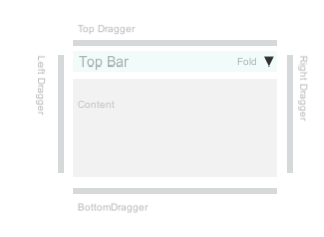

The default panel has five children (Hidden in hierarchy by default), four [Borders](#LayoutBorderDragger) and a [TopBar](#LayoutTopControl). The main object also has three components : [LayoutPanel](#LayoutPanel),  [LayoutFoldController](#LayoutFoldController), and optional (but useful to keep sane) [LayoutBorderHide](#LayoutBorderHide).

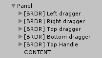

the BRDR name is configurable in code,  [LayoutFoldController](#LayoutFoldController) ignores objects with name containg this tag.

### Basic Layout setup

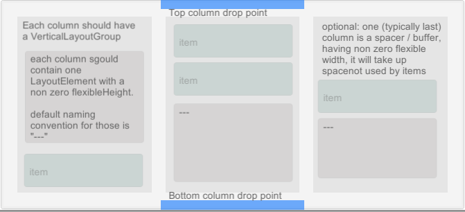

The basic setup consists of a HorizontalLayoutGroup, with each item having a VerticalLayoutGroup, and one special 'spacer' object each. The spacer is a LayoutElement with flexible width / height, so that it will occupy all the space that is not allocated by preffered width / height of your contant. For column, spacers are important because you can dock a panel either top or bottom, which affects draggability.

#### Important: Borders are not visible in hierarchy  

An important thing to note is that top and border objects are by default hidden in hierarchy (to avoid hierarchy congestion), if you find yourself struggling to find the border or top object, it is most likely hidden. Find root object of your item and select 'Visibe'. Congratulations, you have just familiarized yourself with one of the eight components of LayoutPanel ([read more here](#LayoutBorderHide))

Top and bottom droppers (Column Droppers) are ordinary LayoutBorderDrags with ColumnMode = true;

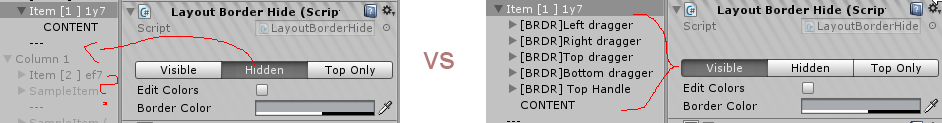

##  Getting Started: Using LayoutCreator
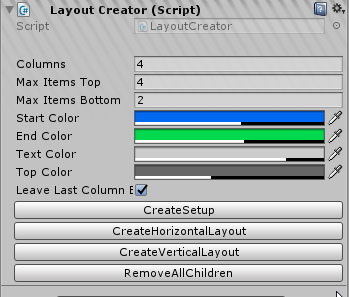

The easiest way to get started with layout panel, is to create a standard unity Panel (filling the canvas), and add LayoutCreator component to it. It will basically do it all when yo press 'Create Setup'

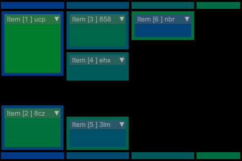

### Getting Started: Do it yourself

If yout want to know better what it's doing, you don't have to use Layout Creator. Start by creating a horizontal layout group (there is a shortcut that does it for you too:)

This will add three children to your selected RectTransform. Add another child Panel, and add LayoutItemCreator component to it (or use a shortcut pictured above).

### LayoutItemCreator
Item creator can be removed once the panel is functional, but its useful to ensure that things are in order. You'll probably want to save its output as a prefab, after stylising it yourself.

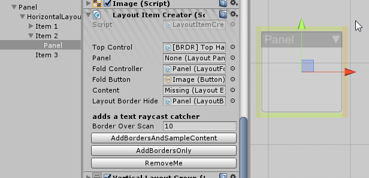

If you are following the DIY way, go and add LayoutColumn component to each of those columns and you are good to go. 

### LayoutColumn
The main purpose of LayoutColumn is to inform LayoutPanels of their position in the structure, mainly if they are above or below the spacer object (flexible height object). This affects resize and drop functionality. It will also add a VerticalLayoutGroup

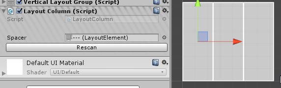

### LayoutPanel
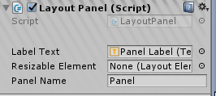

Despite sharing the name with the addon, this script contains little functinality. It merely provides pointer to a resizable element for border draggers

### LayoutFoldController

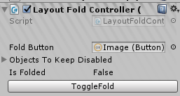

Fold controler binds to a button. When clicked it starts a coroutine disbaling, or re-enabling objects one per frame. This has proven to work much better then trying to force the rect into a size and animating it, trust me.
List of objects to keep disabled is populated on fold - this is to ensure objects that are disabled on fold, stay disabled on unfold (rather than enabling all children)

### LayoutTopControl

Top controler handles drag and drop operations on a panel. 

### LayoutBorderDragger

Border dragger is the main component of LayoutPanel, really. It has two functionalities. 
1) It resizes a LayoutElement provided by parent LayoutPanel component when drag operation is performed on the border.
2) When LayoutTopControl is draging an object, it provides a source (IDropTarget) for the drop.

It also has a funky Side setter which aligns the border with the parent rect, if you want differently sized, spaced or coloured borders, look here.

Border draggers are also used on top and bottom edges to faciliate dropping to a new column.

For the resize functionality to work, LayoutPanel need to point to a LayoutElement with preferred Width/Height. If you add LayoutElement to your panel, you can use that, or you can use one of your content objects. [Read more here](#Tips)

When the border is dragged, the dragger will modify target's prefferedWidth or prefferedHeight. If the target is unknown, the drag will be disabled.

### Layout Border Hide

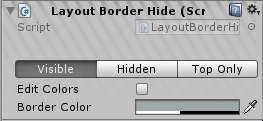

[Hides, unhides](#BorderViz), and sets color of a border.

I have some color pallet synchronization solutions ready but I didn't want to make LayoutPanel too involved.

###  Using LayoutPanel

LayoutPanel is meant to be a Fire-and-forget solution to panels, but there are some things to keep in mind when creating actual interfaces.

A lot depends on LayoutElement settings of your content object. Aany non-frame child of LayoutPanel is considered content, one selected LayoutElement is targetted by borders on drag. Because we are not using (we can, but we don't have to) LayoutElement on the panel itselt, it is transparent to the LayoutGroup, the more settings on your content objects matter. 

As the draggers will modify selected content objects' preffered width/height, for the drag-to-resize functionality to work, there needs to be a target LayoutElement set in the LayoutPanel. The creator is creating a placeholder objects, but in real applications you want the resize target to be something meaningful (part of the panel that can resize, or the panel itself, if you add LayoutElement to it).

Keep in mind that if you use Flexible width or height anywhere, it will propagate up to the master horizontal layout, any child content LayoutElement can affect the whole layout by providing unreasonable Preffered or Flexible size values.

It seems that very low (0.01?) flexible Width/Height is all right, and fights with the main layout just a little bit

### To Do / Pull Requests

Free layout subdivisions, obviously. The aim would be Adobe AE/PR kinf od interface but is still pretty far from it.

This is an open ended project and I would be  happy to accept contributions

### Compatibility
Layout Panel is targetting 2017.4, 2019 seems to have no issues,  tweaks have been made to ensure 5.6 compatibility (.NET 2.0 and slightly different object creation order) 

If, for any reason, you have zCore imported into your project, remove 'Dependencies' folder as it will give duplicates.
