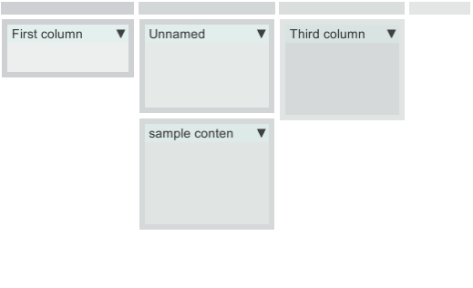

## Layout Panel

Layout Panel provides resize, drag and drop and fold functionality on top of UnityUI. It is based on top of
LayoutGroups, and contains one click creators to support your development with a useful starting point

### Update 2025

I just tried to run it in Unity 6000.3 - quite a jump from Unity 2017.4 on which this was developed back in 2019.
Surprisingly little was broken - main thing was that there is no longer a default font in Unity, so I decided to bundle
free and open source OpenSans.ttf with the package. There were some warnings, some minor problems.
I've tried to move the Editors to UIElements, but the trademark tiled background texture is such a hard thing to
replicate - VisualElement's style.background is just not not as brutally efficient as GUI.DrawTextureWithTexCoords.

I've cleaned up namespaces, some code cleanup here and there, but no breaking API changes outside of that. Textures
have been moved to a subfolder within Resources to avoid possible name collisions. Also .asmdefs have been added. 

When I was pushing this update, I realized there had been more work on the dev branch. Oh well.

### Goals

The aim of this project was to replicate behavior known from many proffesional software suites such as Adobe After Effects,
Adobe Premiere, or even Unity Editor itself, where you can place a panel anywhere, intuitively.

This solution works in a hybrid mode - you need to lay out the groundwork in the Editor (using temporary components that
are used to split a RectTransform area into Horizontal or Vertical slices). Once the basic layout is drafted, user
can edit it in runtime, dragging borders between sections, or even moving panels between different layout sections. 
Its not completely bullet proof, if you try hard enough you can break the layout eventually, but is way past usable, for
the scope of things that could be done in Unity runtime.

### [Please see Docs for much more detailed describtion](./Docs/LayoutPanel.md)

